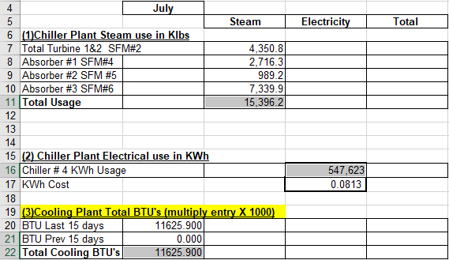
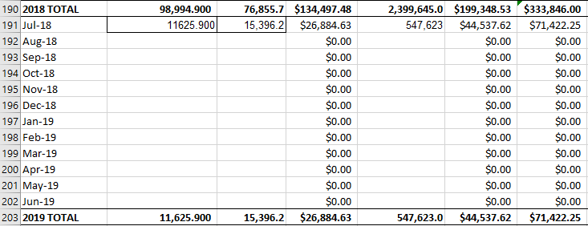
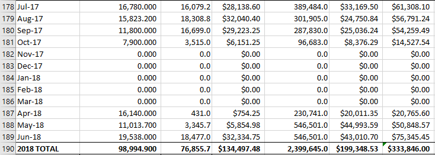

# Chilled Water

**1.)** Chilled water comes from the CHILLED WATER document. You will be using the total values from sections 1-3. NOT In the order they appear.

**2.)** Copy the Total Cooling BTU’s, Steam Usage, and KWh values and paste them into their respective place in the SUMMARY.
  - **Section 1** goes in **Column C**
  - **Section 2** goes in **Column E**
  - **Section 3** goes in **Column B**

**3.)** Do this for the rest of the FY.

---

#### NOTE:
There will be no data from November to March. The chilled water plant is disabled during the winter. 

---
