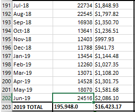

# Electricity & Steam
Electricity and steam (E+S) data are formatted exactly the same, so for this section, the same steps will be used twice. Replace DOCUMENT with ELECTRICITY or STEAM respective to which data you are working on.

---

**1.)** ONLY use data from the "Meter Readings" tab.

**2.)** For electricity & steam data, you are going to want to use the "Paste - Transpose" option. This option transposes the data from a row to column, or vice versa.

**3.)** Select and copy the row for the current building. REMEMBER, only copy July - May. Junes data will come from the next years spreadsheet.

**4.)** Right click on the appropriate cell to paste in the SUMMARY document and choose "Paste - Transpose"

**5.)** Finally, copy and paste the June data from the current years DOCUMENT.

---
#### NOTE:

Make sure that when you open the DOCUMENT you choose the "Enable Editing" option if you are prompted. If you do not, the "Paste - Transpose" option will not appear.

---

| | [Table of Contents](https://uw-whitewater-sustainability.github.io/Utility%20Summary/data) | |
|-------------|-------------|-------------|
| [**Home**](https://uw-whitewater-sustainability.github.io/Utility%20Summary) | [**Global Data**](https://uw-whitewater-sustainability.github.io/Utility%20Summary/global) | [**Hall Data**](https://uw-whitewater-sustainability.github.io/Utility%20Summary/reshalls) |
| [Getting Started]() | [Stormwater](https://uw-whitewater-sustainability.github.io/Utility%20Summary/storm) | [Electricity & Steam](https://uw-whitewater-sustainability.github.io/Utility%20Summary/elecsteam) |
| | [Chilled Water](https://uw-whitewater-sustainability.github.io/Utility%20Summary/chilled) | [Water](https://uw-whitewater-sustainability.github.io/Utility%20Summary/water) |
| | | [Natural Gas](https://uw-whitewater-sustainability.github.io/Utility%20Summary/gas) |