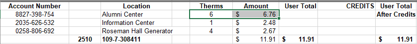
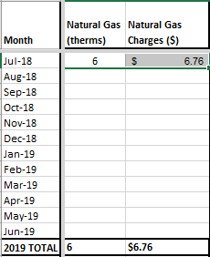
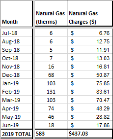
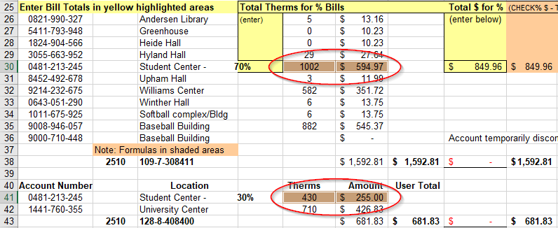

# Natural Gas
Natural gas data is going to come from the EOM workbook.

---

**1.)** Go to the July tab for the desired FY.

**2.)** Select and copy the therm and $ values for the current building. 

**3.)** Paste the values into their respective place in the SUMMARY.

**4.)** Do this for the rest of the FY.

---

#### NOTE:
Some natural gas data is split up between two spots for financial reasons. These rows will be highlighted orange to signify this. For these cases, you MUST add the two rows to get a total value for therms and cost.

---

| | [Table of Contents](https://uw-whitewater-sustainability.github.io/Utility%20Summary/data) | |
|-------------|-------------|-------------|
| [Home](https://uw-whitewater-sustainability.github.io/Utility%20Summary) | [Global Data](https://uw-whitewater-sustainability.github.io/Utility%20Summary/global) | [Hall Data](https://uw-whitewater-sustainability.github.io/Utility%20Summary/reshalls) |
| [Getting Started]() | [Stormwater](https://uw-whitewater-sustainability.github.io/Utility%20Summary/storm) | [Electricity & Steam](https://uw-whitewater-sustainability.github.io/Utility%20Summary/elecsteam) |
| | [Chilled Water](https://uw-whitewater-sustainability.github.io/Utility%20Summary/chilled) | [Water](https://uw-whitewater-sustainability.github.io/Utility%20Summary/water) |
| | | [Natural Gas](https://uw-whitewater-sustainability.github.io/Utility%20Summary/gas) |