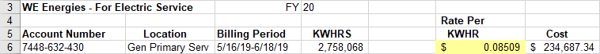
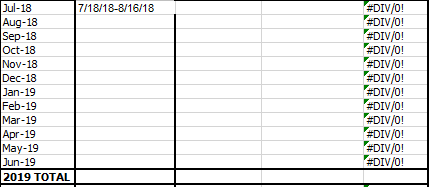
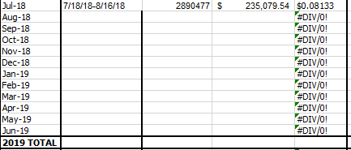
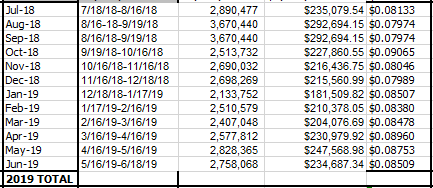

# Global Data
All global data is going to come from the UTILITY workbook.

## Steam

**1.)** Global steam data comes from the UTILITY document. Look for it around row 20 or so. 

**2.)** Copy the klb and $ values and paste them into their respective place in the SUMMARY.

**3.)** Do this for the rest of the FY.

---

#### NOTE: 
Sometimes a month will have more than one $ amount. This is for different rates of steam charges. Always copy the sum total amount. See the selected cells in the figure below.

---
**4.)** You must now enter the equation for the $/klb. In the final column of the first row, enter the **=** sign. Then, while that cell is still being edited, click on the **B** column of that row. Enter the **/** key. Finally, click the **D** column of that row and press enter. The final equation should be “=Bx/Dx” where x is the row number. 

**5.)** Finally, drag the equation down to fill the whole year. This is the last step for this data.

## Electricity

**1.)** Global electricity data comes from the UILITY document, Look for it at the top.

**2.)** Copy the elctricity **Billing Period** from column **C** to its respecive spot in column **I** of the SUMMARY.

**3.)** Copy the kWh and $ values and paste them into their respective place in the SUMMARY.

**4.)** Do this for the rest of the FY.

---

| | [Table of Contents](https://uw-whitewater-sustainability.github.io/Utility%20Summary/data) | |
|-------------|-------------|-------------|
| [Global Data](https://uw-whitewater-sustainability.github.io/Utility%20Summary/global) | [Stormwater](https://uw-whitewater-sustainability.github.io/Utility%20Summary/storm) | [Chilled Water](https://uw-whitewater-sustainability.github.io/Utility%20Summary/chilled) |
| [Hall Data]()   | [Academic]()    | [Residence]()   |
| [Home](https://uw-whitewater-sustainability.github.io/Utility%20Summary) | [Getting Started]() | |

