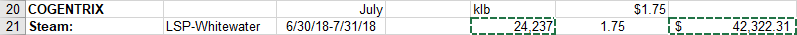

# Global Data
All global data is going to come from the UTILITY workbook.

## Steam

Global steam data comes from the UTILITY document. Look for it around row 20 or so. 

Copy the klb and $ values and paste them into their respective place in the SUMMARY.

Do this for the rest of the FY.

---

#### NOTE: 
Sometimes a month will have more than one $ amount. This is for different rates of steam charges. Always copy the sum total amount. See the selected cells in the figure below.

---
You must now enter the equation for the $/klb. In the final column of the first row, enter the “=” sign. Then, while that cell is still being edited, click on the B column of that row. Enter the ‘/’ key. Finally, click the D column of that row and press enter.  The final equation should be “=Bx/Dx” where x is the row number. 

Finally, drag the equation down to fill the whole year. This is the last step for this data.

# Electricity

---
[back](https://hunttj21.github.io/UWW-Documentation/Utility%20Summary/data)

[home](https://hunttj21.github.io/UWW-Documentation/Utility%20Summary)
