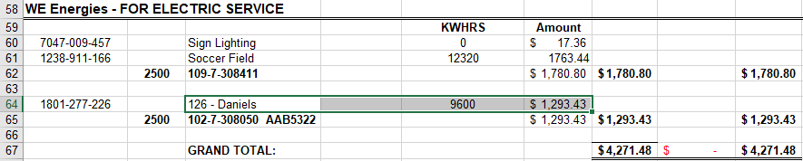

# Academic & Residence Halls
Academic & residence hall data comes from many different source documents. Most halls will have a electricity, gas, steam, and water data to enter. The links below are for halls in general, below that is a list of specific instructions for idiosyncratic buildings.

---

## General Instructions

- ### [Electricity & Steam](https://uw-whitewater-sustainability.github.io/Utility%20Summary/elecsteam)
- ### [Water](https://uw-whitewater-sustainability.github.io/Utility%20Summary/water.md)
- ### [Natural Gas](https://uw-whitewater-sustainability.github.io/Utility%20Summary/gas.md)

---

## Special Cases

- ### Community Engagement Center
  - Also referred to as
    - 126 - Daniels
    - CEC
    - CO-OP ParkLotStorm
  - **Electricity Data comes from EOM spreadsheet**

---

| | [Table of Contents](https://uw-whitewater-sustainability.github.io/Utility%20Summary/data) | |
|-------------|-------------|-------------|
| [Home](https://uw-whitewater-sustainability.github.io/Utility%20Summary) | [Global Data](https://uw-whitewater-sustainability.github.io/Utility%20Summary/global) | [Hall Data](https://uw-whitewater-sustainability.github.io/Utility%20Summary/reshalls) |
| [Getting Started]() | [Stormwater](https://uw-whitewater-sustainability.github.io/Utility%20Summary/storm) | [Electricity & Steam](https://uw-whitewater-sustainability.github.io/Utility%20Summary/elecsteam) |
| | [Chilled Water](https://uw-whitewater-sustainability.github.io/Utility%20Summary/chilled) | [Water](https://uw-whitewater-sustainability.github.io/Utility%20Summary/water) |
| | | [Natural Gas](https://uw-whitewater-sustainability.github.io/Utility%20Summary/gas) |

