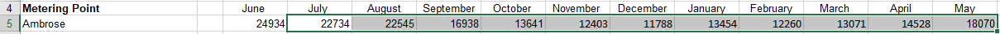
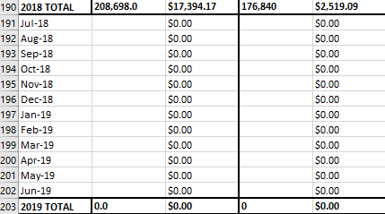

# Academic & Residence Halls
Academic & residence hall data comes from many different source documents. Most halls will have a electricity, gas, steam, and water data to enter. The information below is for residence halls in general

---
#### NOTE:
The information below is for academic & residence halls in general. Information on idiosyncrasies of specific halls can be found in [the next section.]()

---

## Electricity
**1.)** Electricity data comes from the ELECTRICITY document. 
ONLY use data from the "Meter Readings" tab.

**2.)** For electricity data, you are going to want to use the "Paste - Transpose" option. This option transposes the data from a row to column, or vice versa.

**3.)** Select and copy the row for the current building. REMEMBER, only copy July - May. Junes data will come from the next years spreadsheet.

**4.)** Right click on the appropriate cell to paste in the SUMMARY document and choose "Paste - Transpose"

**5.)** Finally, copy and paste the June data from the current years ELECTRICITY document.

---
#### NOTE:

Make sure that when you open the ELECTRICITY document you choose the "Enable Editing" option if you are prompted. If you do not, the "Paste - Transpose" option will not appear.

---

## Steam

## Water

## Gas

| | [Table of Contents](https://uw-whitewater-sustainability.github.io/Utility%20Summary/data) | |
|-------------|-------------|-------------|
| [Home](https://uw-whitewater-sustainability.github.io/Utility%20Summary) | [Global Data](https://uw-whitewater-sustainability.github.io/Utility%20Summary/global) | [Hall Data]() |
| [Getting Started]() | [Stormwater](https://uw-whitewater-sustainability.github.io/Utility%20Summary/storm) | [Academic]() |
| | [Chilled Water](https://uw-whitewater-sustainability.github.io/Utility%20Summary/chilled) | [Residence](https://uw-whitewater-sustainability.github.io/Utility%20Summary/reshalls) |

