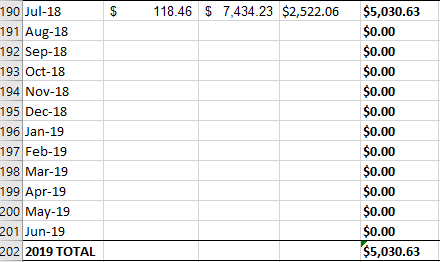

## Stormwater
This section of the SUMMARY is meant for stormwater data for the CEC and UWW Total.
Stormwater data is going to come from the WATER document.

---

**1.)** Each month's data comes from its **Detail Worksheet** NOT Recap&Summary.

**2.)** Look for the data at the bottom of the sheet.

**3.)** You are going to need the $ amounts for both the CO-OP and the UWW stormwater as well as the Stormwater credits highlighted in yellow.
Copy and paste these values into their respective place in the SUMMARY. 

(Make sure that the higlighted value gets entered as a positive number NOT A NEGATIVE like it is when you copy it.)

**4.)** Do this for the rest of the FY

---
#### Hint:
The charges for the Stormwater tend to stay the same, only changing once a year or so. This means that you can save time by only copying the unique values and dragging them down to fill in the rest.

---

#### NOTE:
In the WATER document, the year in each spreadshet is referring to the FISCAL YEAR not the calendar year. This means that data for July of 2018 is in the **July 19** spreadsheet, as it is in Fiscal Year 2019.

---

[back](https://uw-whitewater-sustainability.github.io/Utility%20Summary/data)

[home](https://uw-whitewater-sustainability.github.io/Utility%20Summary)
