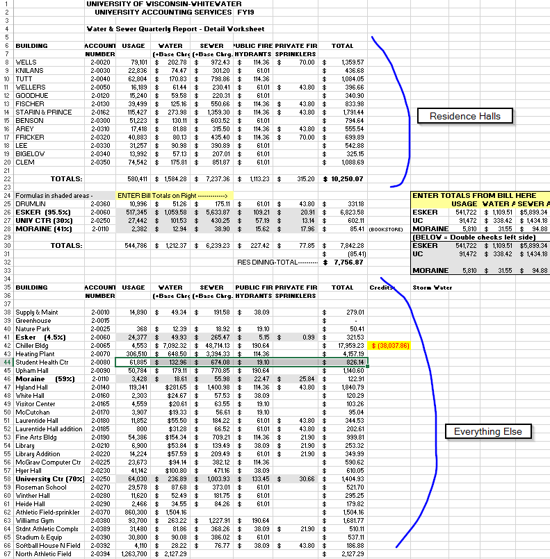
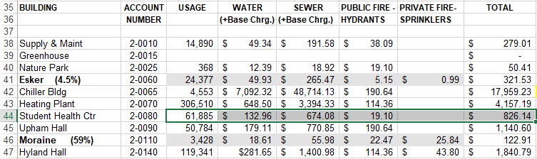
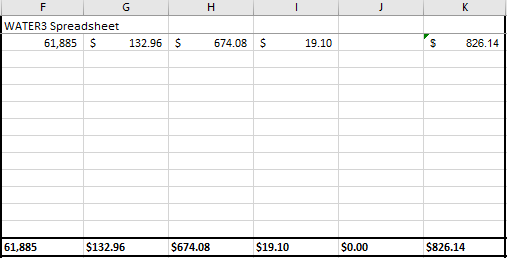
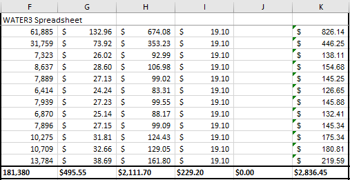

# Water
Water data is going to come from the WATER document.

---

**1.)** Each month's data comes from its **Detail Worksheet** NOT Recap&Summary.

**2.)** Data is spread out between two different sections. Residence halls are at the top of the document and everything else is below them.

**3.)** Select and copy the row for the current building. 

**4.)** Paste the values into their respective place in the SUMMARY.

**5.)** Do this for the rest of the FY.

---
#### NOTE:

Make sure that when you open the WATER document you choose the "Enable Editing" option if you are prompted. If you do not, the formula at the end of the row will not copy.

---

| | [Table of Contents](https://uw-whitewater-sustainability.github.io/Utility%20Summary/data) | |
|-------------|-------------|-------------|
| [Home](https://uw-whitewater-sustainability.github.io/Utility%20Summary) | [Global Data](https://uw-whitewater-sustainability.github.io/Utility%20Summary/global) | [Hall Data](https://uw-whitewater-sustainability.github.io/Utility%20Summary/reshalls) |
| [Getting Started]() | [Stormwater](https://uw-whitewater-sustainability.github.io/Utility%20Summary/storm) | [Electricity & Steam](https://uw-whitewater-sustainability.github.io/Utility%20Summary/elecsteam) |
| | [Chilled Water](https://uw-whitewater-sustainability.github.io/Utility%20Summary/chilled) | [Water](https://uw-whitewater-sustainability.github.io/Utility%20Summary/water) |
| | | [Natural Gas](https://uw-whitewater-sustainability.github.io/Utility%20Summary/gas) |